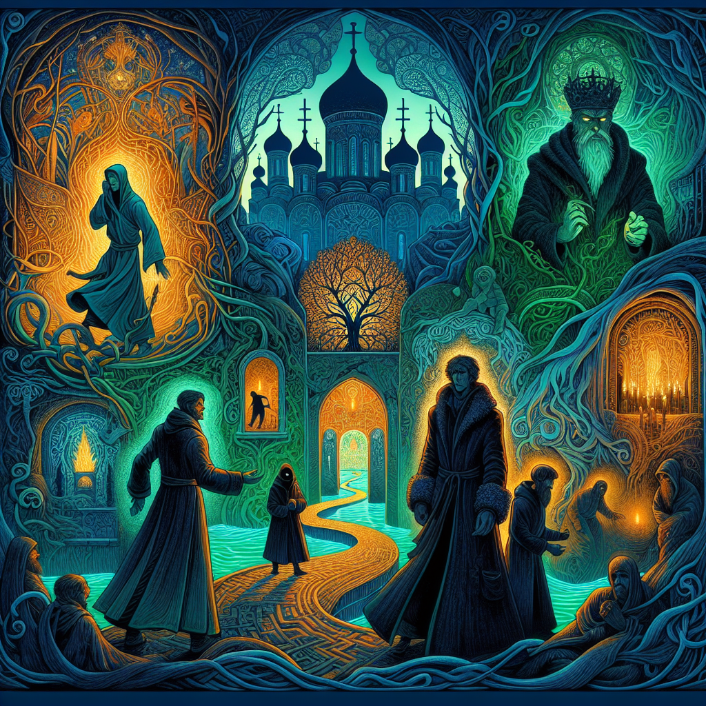

**The Karamazov Conscience**

In the shadow of the monastery's ancient walls, 
Where faith and doubt entwine like ivy's grasp, 
A tale of brothers, bound by blood and fate, 
Unfolds like a dark tapestry, forever great. 

Alyosha, gentle soul, with heart aglow, 
A beacon of compassion, in a world of woe, 
His eyes, like lanterns, shining bright and true, 
Reflecting the beauty, of the human heart, anew. 

Ivan, the skeptic, with mind afire, 
A whirlwind of logic, that reason's highest desire, 
He questions the heavens, with a rebel's cry, 
And in the silence, his own demons, he'll deny. 

Dmitri, the sensual, with passions untamed, 
A heart, aflutter, like a bird, in love's sweet name, 
His desires, a maelstrom, that rage like the sea, 
As he navigates, the treacherous shores, of humanity. 

Smerdyakov, the serpent, with a heart of stone, 
A darkness, that festers, like a wound, untold, 
His eyes, like ice, that freeze the blood in vain, 
As he weaves a web, of deceit, and deadly gain. 

Fyodor Pavlovich, the patriarch, of old, 
A man, of contradictions, with a heart, of gold, 
His legacy, a tangle, of love and strife, 
A family, entwined, in a dance, of life. 

In the town, of Skotoprigonievsk, where the Volga flows, 
The Karamazov brothers, in a tragic, waltz, dispose, 
Their lives, a labyrinth, of love, and bitter strife, 
A dance, of humanity, in the shadow, of life. 

In this, their story, a philosophical treatise, unfolds, 
A quest, for meaning, in the human, heart of gold, 
A search, for truth, in the labyrinth, of the mind, 
A journey, through the darkness, to the light, we find. 