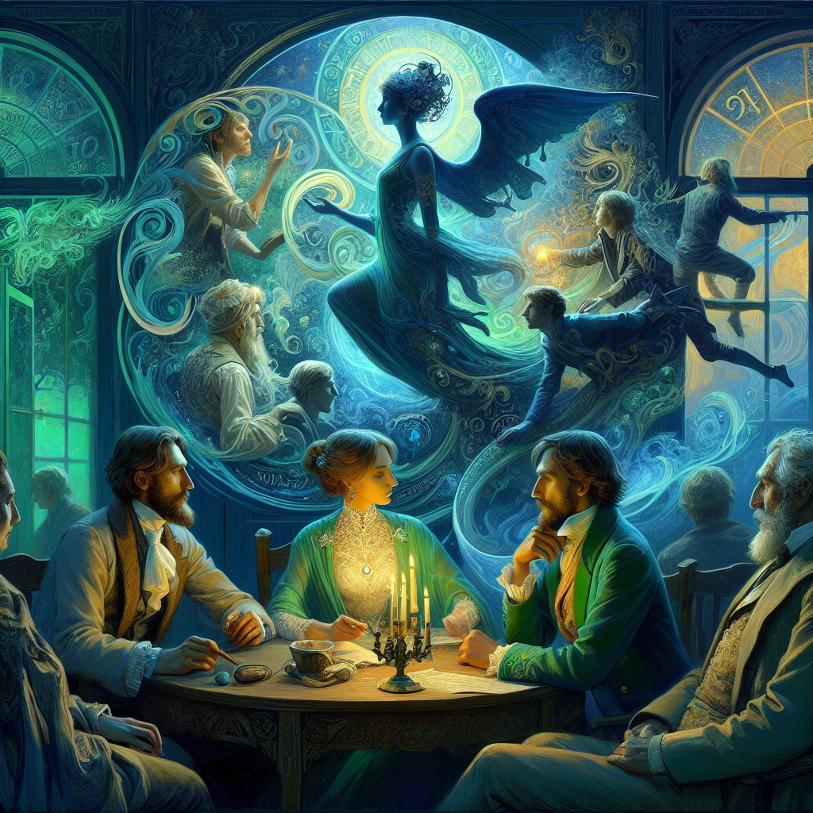

**Die Karamazov-Brüder: Eine Philosophische Odyssee**
 

**Kapitel 1: Die Karamazov-Familie**
Die Karamazov-Familie, ein komplexes Netzwerk von Beziehungen und philosophischen Debatten, steht im Zentrum dieses
epischen Romans. Die Geschichte dreht sich um die drei Brüder, Dmitri, Ivan und Alyosha, die jeweils unterschiedliche
philosophische Perspektiven vertreten. Ihr Vater, Fyodor Pavlovich Karamazov, ein reicher und unmoralischer
Großgrundbesitzer, ist der Katalysator für die Ereignisse, die sich entwickeln.

Dmitri, der älteste, ist ein sinnlicher und impulsiver Offizier, der die Prinzipien des Hedonismus und Nihilismus
verkörpert. Ivan, der mittlere Bruder, ist ein rationaler und atheistischer Intellektueller, der die Ideale des
Determinismus und der moralischen Relativität verkörpert. Alyosha, der jüngste, ist ein mitfühlender und spiritueller
Novize, der die Prinzipien der christlichen Moral und Altruismus verkörpert.

**Kapitel 2: Das Zusammenkommen des Sturms**
Die Geschichte beginnt mit der Ankunft von Dmitri in der kleinen Stadt Skotoprigonievsk, wo sein Vater, Fyodor
Pavlovich, die Ankunft seiner Söhne erwartet. Die Spannung zwischen den Familienmitgliedern ist spürbar, als sie sich im
Kloster versammeln, um das Erbe des Vaters zu diskutieren.

Inzwischen hat die geheimnisvolle und schöne Grushenka, eine Verführerin mit einer mysteriösen Vergangenheit, die
Aufmerksamkeit von Dmitri und seinem Vater erregt. Als die familiären Dynamiken sich entwickeln, beginnen die
philosophischen Debatten zwischen den Brüdern zu formen.

**Kapitel 3: Der Große Inquisitor**
Ivan, der Atheist, präsentiert sein berühmtes Gedicht "Der Große Inquisitor", eine scharfe Kritik am Christentum und
seiner vermeintlichen Heuchelei. Dies löst einen heftigen Streit zwischen Ivan und Alyosha aus, als sie sich mit der
Natur der Moral, der Freiheit des Willens und der Existenz Gottes auseinandersetzen.

In diesem Kapitel verwebt Dostojewski philosophische Konzepte, wie das Problem des Bösen, die Natur der Moral und die
Rolle des Einzelnen in der Gesellschaft, zu einem feinen Gewebe.

**Kapitel 4: Die Geheimnisvolle Grushenka**
Grushenkas Anwesenheit sorgt weiterhin für Unruhe, als Dmitri immer mehr von ihr besessen wird. Inzwischen wird Alyoshas
mitfühlende Natur auf die Probe gestellt, als er versucht, die streitenden Fraktionen innerhalb der Familie zu
versöhnen.

Durch Grushenkas Charakter erkundet Dostojewski die Themen der Moral, der Versuchung und der menschlichen Natur, indem
er Fragen über die Natur des Guten und Bösen aufwirft.

**Kapitel 5: Der Vatermord**
Die Spannung zwischen Fyodor Pavlovich und seinen Söhnen erreicht einen Siedepunkt, der in einem tragischen Ereignis
kulminiert, das ihr Leben für immer verändern wird. Als die Familie auseinanderbricht, nehmen die philosophischen
Debatten eine neue Dringlichkeit an.

In diesem Kapitel erkundet Dostojewski die Konsequenzen des moralischen Relativismus, die Natur der Gerechtigkeit und
die Rolle des Einzelnen bei der Gestaltung seines eigenen Schicksals.

**Kapitel 6: Die Untersuchung**
Als die Untersuchung zum Vatermord beginnt, werden die dunklen Geheimnisse der Familie enthüllt, und die Brüder werden
gezwungen, ihre eigenen moralischen Mängel zu konfrontieren. Ivans Rationalismus wird auf die Probe gestellt, als er
sich mit den Konsequenzen seines eigenen Atheismus auseinandersetzt.

Dostojewski erkundet die Themen der Schuld, der Verantwortung und der Natur der Gerechtigkeit, indem er fundamentale
Fragen über die menschliche Natur aufwirft.

**Kapitel 7: Der Prozess**
Der Prozess gegen Dmitri Karamazov dient als Hintergrund für eine tiefere Erkundung der Moral, der Gerechtigkeit und der
Rolle des Einzelnen in der Gesellschaft. Als die Anklage und die Verteidigung ihre Fälle vorbringen, erreichen die
philosophischen Debatten einen Höhepunkt.

In diesem Kapitel erkundet Dostojewski die Spannung zwischen individueller Freiheit und gesellschaftlichen Zwängen,
indem er Fragen über die Natur der Moral und die Rolle des Staates aufwirft.

**Kapitel 8: Das Urteil**
Das Urteil wird gefällt, und die Familie muss sich mit den Konsequenzen ihrer Handlungen auseinandersetzen. Als die
Brüder über die Ereignisse reflektieren, die sich entwickelt haben, werden sie gezwungen, ihre eigenen moralischen
Mängel zu konfrontieren.

Dostojewski erkundet die Themen der Erlösung, der Vergebung und der Möglichkeit des moralischen Wachstums, indem er
fundamentale Fragen über die menschliche Natur aufwirft.

**Kapitel 9: Der Weg zur Erlösung**
Im Anschluss an den Prozess machen die Brüder sich auf eine Reise der Selbstentdeckung, indem sie sich mit den
Konsequenzen ihrer Handlungen auseinandersetzen. Alyoshas Mitgefühl und Weisheit dienen als Leuchtfeuer der Hoffnung,
als die Familie beginnt, zu heilen und sich neu zu formieren.

In diesem Kapitel erkundet Dostojewski die Themen der Erlösung, der Vergebung und der Möglichkeit des moralischen
Wachstums, indem er fundamentale Fragen über die menschliche Natur aufwirft.

**Kapitel 10: Das Vermächtnis der Karamazovs**
Als die Geschichte zu Ende geht, treten die Karamazov-Brüder transformiert hervor, ihre philosophischen Debatten haben
ihr Verständnis der Welt und ihrer Rolle darin geprägt. Der Roman endet mit einem Gefühl der Hoffnung und Erlösung, als
die Brüder in die Zukunft blicken, für immer von ihren Erfahrungen geprägt.

In diesem letzten Kapitel verwebt Dostojewski die philosophischen Fäden, die sich durch den ganzen Roman gezogen haben,
zu einem reichen Teppich von Ideen, die bis heute bei den Lesern nachhallen.